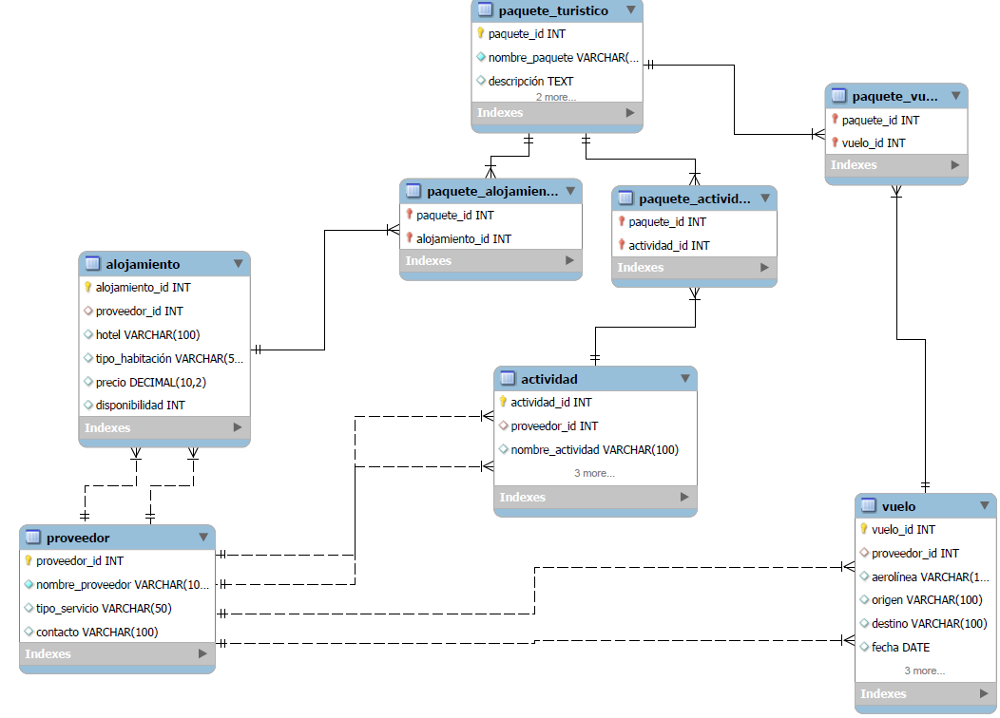

# Entrega de proyecto final

@Alunno Sonny Del Valle

@Comision 59410

@Tutor Melina Solorzano

@Docente Anderson Michael Torres

# Consignas:
La base de datos debe contener al menos:

~ 15 tablas, entre las cuales debe haber al menos 1 tabla de hechos, 2 tablas transaccionales.
~ 5 vistas.
~ 2 stored procedure.
~ 2 trigger.
~ 2 funciones
El documento debe contener:

# Introducción
Objetivo
Situación problemática
Modelo de negocio
Diagrama de entidad relació
Listado de tablas con descripción de estructura (columna,descripción, tipo de datos, tipo de clave)
Scripts de creación de cada objeto de la base de datos
Scripts de inserción de datos
Informes generados en base a la información de la base
Herramientas y tecnologías usadas

Comandos
make (Comando Principal)
Levanta el contenedor Docker, construye la imagen si es necesario, y ejecuta el script que inicializa la estructura de la base de datos, crea objetos, y la llena con datos iniciales. Este ejecutara los comandos: make up, make objects, make population y make roles; esto sin necesidad de ejecutarlos todos uno tras otro.

make
make up
Inicia y configura el contenedor Docker de MySQL, construyendo la imagen si es necesario y esperando a que el servicio esté disponible antes de ejecutar el script que inicializa la estructura de la base de datos.

make up
make objects
Recorre todos los archivos SQL en la carpeta ./objects y los ejecuta dentro de la base de datos para crear todos los objetos necesarios, como tablas, vistas, y procedimientos almacenados.

make objects
make population
Ejecuta el script ./structure/population.sql para llenar las tablas de la base de datos con datos iniciales o de ejemplo.

make population
make roles
Configura roles y usuarios en la base de datos utilizando los scripts roles.sql y users.sql localizados en la carpeta ./roles. Permite gestionar los permisos y los accesos a las tablas y procedimientos de manera estructurada.

make roles
make show-roles-users
Muestra todos los roles y usuarios de la base de datos en un formato tabular para facilitar la visualización de las configuraciones y permisos de los usuarios.

make show-roles-users
make test-db
Revisa y muestra las primeras 5 filas de cada tabla de la base de datos, permitiendo una rápida validación de la estructura y el contenido de las tablas.

make test-db
make access-db
Accede al cliente MySQL en modo interactivo dentro del contenedor Docker, permitiendo ejecutar consultas y comandos directamente en la base de datos.

make access-db
make clean-db
Elimina la base de datos especificada en las variables de entorno, útil para limpiar el entorno de pruebas o reiniciar el estado de la base de datos.

make clean-db
make backup-db
Genera una copia de seguridad de la base de datos y la guarda en la carpeta ./backups con un nombre que incluye la fecha y la hora de creación, para facilitar la identificación y restauración en el futuro.

make backup-db
make restore-db
Restaura la base de datos utilizando un archivo de respaldo especificado. El archivo debe estar ubicado en la carpeta ./backups.

make restore-db BACKUP_FILE=./backups/tu-backup.sql
make restore-latest
Restaura la base de datos utilizando el archivo de respaldo más reciente ubicado en la carpeta ./backups. Esta opción es útil para restaurar rápidamente la versión más actual sin necesidad de especificar un archivo en particular.

make restore-latest

Tematica del proyecto
El sistema de bases de datos que se ha diseñado tiene como objetivo gestionar un servicio de reserva de paquetes turísticos, el cual incluye clientes, proveedores, pagos, reservas, vuelos, alojamientos y actividades. Este sistema permite almacenar y procesar de manera eficiente la información relacionada con las reservas de paquetes turísticos, asegurando la integridad de los datos mediante el uso de claves foráneas y triggers. Además, se emplean funciones, procedimientos almacenados y vistas para optimizar la consulta y manipulación de los datos.

# Modelo de negocio

Venta de Paquetes de Viaje y Pasajes de Avión:

    Oferta personalizada: Proporcionar paquetes turísticos personalizados que combinen vuelos, alojamiento y actividades, adaptados a las preferencias y presupuestos de los clientes.
    Plataforma centralizada: Utilizar una plataforma digital que permita a los clientes comparar, personalizar y comprar pasajes de avión y paquetes turísticos en un solo lugar.
    Optimización y conveniencia: Ofrecer opciones optimizadas de viajes y paquetes que ahorren tiempo y dinero a los clientes, con una experiencia de usuario intuitiva y fácil de usar.

# Listado de tablas y descripción

CLIENTE_CATEGORIA: Define las categorías de clientes, incluyendo descripción y beneficios asociados.
CLIENTE: Contiene información básica de los clientes, incluyendo su categoría.
PAQUETE_TURISTICO: Describe los paquetes turísticos, incluyendo el precio y la disponibilidad.
RESERVA: Registra las reservas realizadas por los clientes para los paquetes turísticos.
PAGO: Registra los pagos realizados por los clientes asociados a una reserva.
PROVEEDOR: Almacena la información de los proveedores que ofrecen vuelos, alojamientos y actividades.
VUELO: Detalla la información sobre los vuelos ofrecidos en los paquetes turísticos.
ALOJAMIENTO: Contiene la información sobre los alojamientos ofrecidos en los paquetes turísticos.
ACTIVIDAD: Describe las actividades turísticas disponibles en los paquetes.
OPINION_CALIFICACION: Permite registrar las opiniones y calificaciones de los clientes sobre vuelos, alojamientos y actividades.
PAQUETE_VUELO, PAQUETE_ALOJAMIENTO, PAQUETE_ACTIVIDAD: Tablas intermedias que relacionan los paquetes turísticos con vuelos, alojamientos y actividades.

# Estructura e ingesta de datos
Se realiza principalmente por medio del archivo population.sql
La carga de la tabla reserva se realiza por medio de un csv colocado en el directorio ./structure/data-csv

Para crear un documento PDF que incluya el paso a paso de la importación de datos desde archivos CSV a MySQL, te proporciono un esquema de ejemplo para que puedas estructurar tu documento. Incluyo secciones para la explicación detallada del proceso y cómo adjuntar los archivos necesarios.
Proyecto Final: Importación de Datos a MySQL
Descripción del Proyecto

Este documento describe el proceso de importación de datos desde un archivo CSV hacia una base de datos MySQL. Se utilizará la tabla CLIENTE como ejemplo y se mostrarán los pasos a seguir para cargar los datos desde el archivo CLIENTE.csv a la base de datos.
Archivos Incluidos:

    CLIENTE.csv: Archivo CSV que contiene los datos de los clientes.
    Script SQL: Archivo .sql que contiene el esquema de la tabla CLIENTE.
    Este documento PDF: Explicación detallada de los pasos de importación y enlaces a los archivos en el repositorio de GitHub.

1. Creación de la Tabla CLIENTE
Script de Creación de la Tabla

Antes de importar los datos, asegúrate de haber creado la tabla CLIENTE. A continuación, se muestra el script SQL utilizado para crear la tabla:

sql

CREATE TABLE CLIENTE (
    id INT AUTO_INCREMENT PRIMARY KEY,
    nombre VARCHAR(100),
    apellido VARCHAR(100),
    documento_identidad VARCHAR(20),
    email VARCHAR(100),
    telefono VARCHAR(20),
    categoria_id INT,
    FOREIGN KEY (categoria_id) REFERENCES CATEGORIA(id)
);

El archivo SQL completo con la estructura de la base de datos se encuentra en el repositorio de GitHub, accesible en el siguiente enlace:

Repositorio GitHub - Script SQL
2. Importación de Datos desde Archivo CSV

A continuación se detalla el proceso para importar el archivo CLIENTE.csv a la tabla CLIENTE en MySQL.
Método 1: Usando el Comando LOAD DATA INFILE

    Abre MySQL Workbench y asegúrate de estar conectado a tu base de datos.

    Ejecuta el siguiente comando SQL para cargar los datos desde el archivo CSV a la tabla CLIENTE:

    sql

LOAD DATA LOCAL INFILE 'C:/ruta/a/CLIENTE.csv'
INTO TABLE CLIENTE
FIELDS TERMINATED BY ','
ENCLOSED BY '"'
LINES TERMINATED BY '\n'
IGNORE 1 ROWS
(nombre, apellido, documento_identidad, email, telefono, categoria_id);

Verifica los Datos: Después de ejecutar el comando, verifica que los datos se hayan cargado correctamente en la tabla:

sql

    SELECT * FROM CLIENTE;

    Confirmación: Si todo se ha realizado correctamente, los datos del archivo CLIENTE.csv estarán presentes en la tabla CLIENTE.

Método 2: Importación Gráfica en MySQL Workbench

    Abre MySQL Workbench.
    Selecciona tu base de datos (choice_in).
    Haz clic derecho sobre la base de datos y selecciona "Table Data Import Wizard".
    Selecciona el Archivo CSV: Busca y selecciona el archivo CLIENTE.csv en tu computadora.
    Configura las Opciones de Importación:
        Asegúrate de que las columnas estén correctamente delimitadas por comas.
        Especifica que la primera fila del archivo contiene los nombres de las columnas.
    Selecciona la Tabla CLIENTE como destino para los datos.
    Finaliza la Importación: Sigue los pasos del asistente de importación para completar el proceso.

3. Enlaces de GitHub

Para acceder a los archivos utilizados en este proyecto, como el script SQL y el archivo CSV, visita el siguiente enlace a GitHub:

Repositorio GitHub - Archivos del Proyecto
Archivos Incluidos en el Repositorio:

    CLIENTE.csv: Contiene los datos de los clientes.
    script.sql: Script para la creación de las tablas.
    Instrucciones en PDF: Este documento en formato PDF, que describe el proceso paso a paso.

4. Paso a Paso para la Importación en MySQL Workbench

El siguiente es un resumen visual del proceso de importación en MySQL Workbench usando la opción gráfica:

    Accede a la Herramienta de Importación.
    Selecciona el Archivo CSV.
    Configura los Delimitadores y las Columnas.
    Confirma la Tabla de Destino.
    Verifica la Importación de Datos.

5. Conclusiones

Este documento detalla los pasos para importar un archivo CSV en MySQL y proporciona tanto un método basado en comandos como una guía para realizarlo de manera gráfica. Además, se incluyen los enlaces a los archivos en GitHub para referencia y uso en futuros proyectos.
Ejemplo de Contenido del Archivo CSV (CLIENTE.csv)

csv

nombre,apellido,documento_identidad,email,telefono,categoria_id
Juan,Pérez,123456789,juan.perez@example.com,5551234,1
Ana,Gómez,987654321,ana.gomez@example.com,5555678,2
Carlos,Martínez,456789123,carlos.martinez@example.com,5554321,3

Nota:

Puedes añadir más detalles y personalizar este ejemplo según la estructura y los datos de tu proyecto.